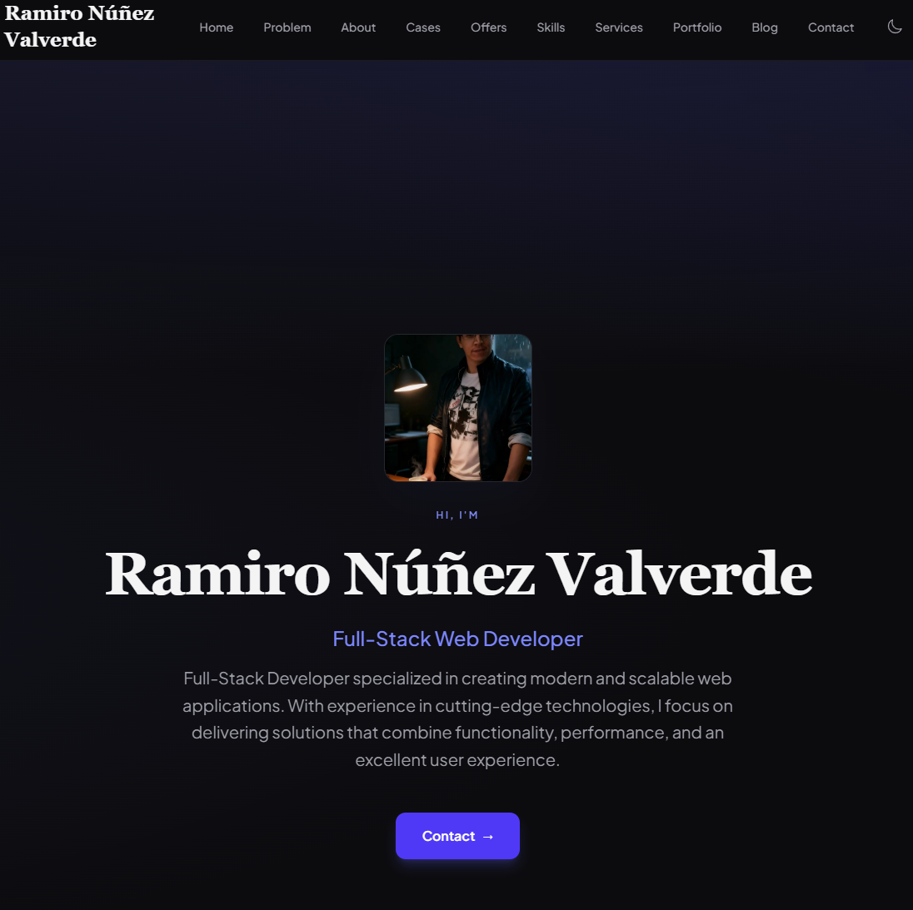
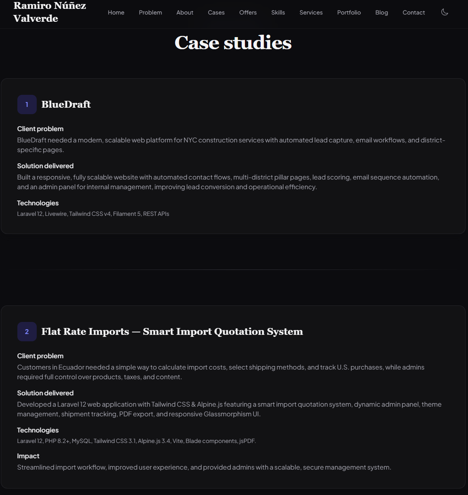
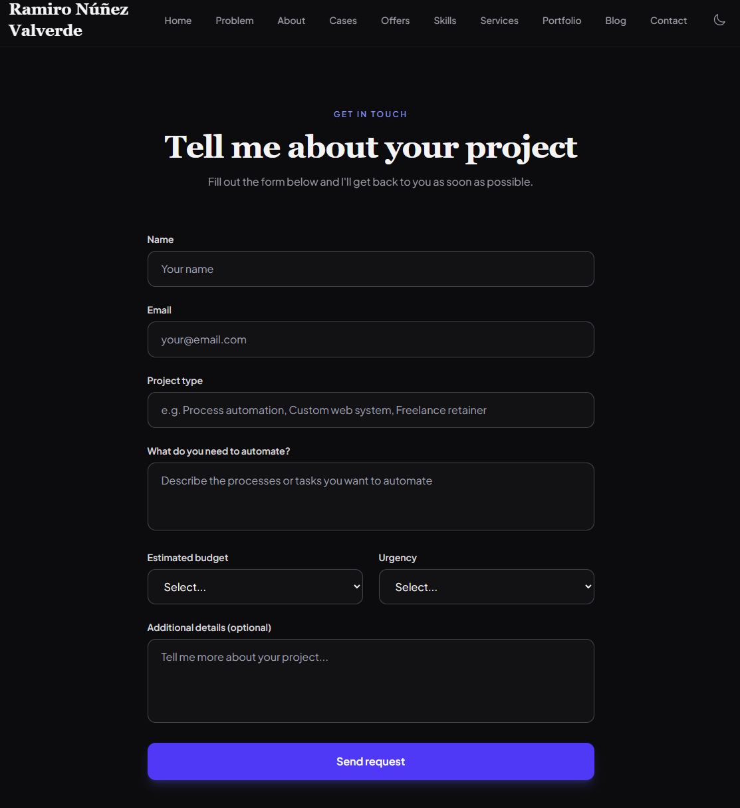
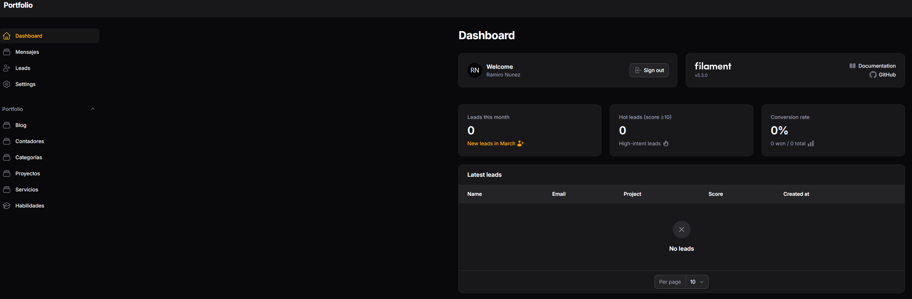

# Portfolio Ramiro

Portfolio personal con **funnel de captación de leads**, desarrollado con **Laravel 12, Filament 5, Blade, Livewire, Tailwind CSS y Alpine.js**.  
Diseñado para **mostrar tus habilidades** y capturar leads reales de forma profesional.



---

## 🌐 Demo en producción

https://ramironuva.com

---

## 🚀 Características principales

- 🎯 **Landing orientada a conversión**: secciones Problema, Casos de éxito, Ofertas  
- 📝 **Formulario de leads** con scoring automático (frío/medio/caliente)  
- ⚙️ **Panel admin Filament**: leads, proyectos, skills, servicios, blog, configuración  
- ✉️ **Email automation**: integración con Brevo + webhook genérico  
- 📆 **Calendly embebido** para agendar consultas  
- 🔍 **SEO avanzado**: meta dinámicos, Open Graph, Sitemap, Schema.org  
- 🌗 **Modo oscuro/claro** con `prefers-color-scheme`  
- 📊 **Reporting y métricas**: scoring de leads, cantidad de captaciones, conversiones  

---

## 🖼️ Screenshots

### Página principal


### Sección Problema / Casos de éxito / Ofertas


### Formulario de leads


### Panel Admin (Filament)


---

## 🏗 Arquitectura del sistema

### Frontend
- Blade + Tailwind CSS + Alpine.js
- Livewire para componentes dinámicos
- PWA / Modo oscuro/claro

### Backend
- Laravel 12
- Filament 5 para panel admin
- Jobs para automatización de leads
- Webhooks para envío de leads a sistemas externos

### Base de datos
- SQLite (dev) / MySQL (prod)

### Integraciones externas
- Brevo (email automation)
- Webhooks genéricos (Zapier / Make)
- Calendly embebido

---

## 📂 Estructura del proyecto
app/
├── Filament/ # Panel admin (Resources, Pages)
├── Http/Controllers/
├── Jobs/ # SyncLeadToEmailProvider
├── Models/
├── Services/ # PortfolioDataService, LeadScoringService, LeadAutomationService
resources/views/
├── portfolio/components/ # Hero, About, Skills, Services, Portfolio, Blog, Contact
├── portfolio/components/ # Problem, Case-studies, Offers, Calendly
└── components/ # Contact form (Volt/Livewire)

---

## 📈 Funnel de captación de leads

1. Usuario visita la landing → ve secciones Problema, Casos de éxito y Ofertas  
2. Completa **formulario de leads** → lead se califica automáticamente (frío/medio/caliente)  
3. Lead es enviado vía **webhook a Brevo / Zapier / Make**  
4. Email automation y seguimiento personalizado  
5. Posibilidad de agendar consulta directamente vía **Calendly**  
6. Panel admin permite **gestionar, filtrar y analizar leads**

---

## ⚙️ Requisitos

- PHP ≥ 8.2  
- Composer ≥ 2.x  
- Node.js ≥ 18  
- SQLite (desarrollo) / MySQL (producción)  

---

## 💻 Instalación

```bash
# Clonar repositorio
git clone https://github.com/leranuva/portfolio_ramiro.git
cd portfolio_ramiro

# Instalar dependencias backend
composer install

# Copiar y generar variables de entorno
cp .env.example .env
php artisan key:generate

# Ejecutar migraciones
php artisan migrate

# Instalar dependencias frontend
npm install
npm run build

# Crear enlace de storage
php artisan storage:link

# Iniciar servidor
php artisan serve

# Para trabajar con cola de leads:

php artisan queue:work

⚙️ Variables de entorno importantes
Variable	Descripción
LEAD_WEBHOOK_URL	Webhook para enviar leads (Zapier, Make, etc.)
BREVO_API_KEY	API key de Brevo
BREVO_LEADS_LIST_ID	Lista de Brevo donde se envían leads
QUEUE_CONNECTION	sync (inmediato) o database (requiere worker)

📄 Documentación
Documento	Contenido
docs/README.md
	Índice de documentación
docs/GUIA_IMPLEMENTACION_PORTFOLIO.md
	Guía completa del proyecto
docs/FUNNEL_CAPTACION_IMPLEMENTADO.md
	Funnel de leads, scoring, automatización
docs/GUIA_MARKETING_LEADS.md
	Estrategia LinkedIn, emails, SEO
🔗 Links de interés

Portfolio live: https://ramironuva.com

GitHub: https://github.com/leranuva

👨‍💻 Autor

Ramiro Nunez – Full-Stack Developer

Especializado en:

Web Applications

Full-Stack Development

AI & Automation

Growth & Marketing Integration

📄 Licencia

MIT


---

### ✅ Qué hace este README profesional:

1. **Impacto visual inmediato:** hero/banner arriba y link al demo en producción.  
2. **Screenshots:** muestran landing, leads y panel admin.  
3. **Arquitectura clara:** frontend, backend, base de datos, integraciones externas.  
4. **Funnel explicado paso a paso:** recruiters/clientes entienden cómo funciona el sistema.  
5. **Documentación y enlaces:** fácil de navegar y profesional.  
